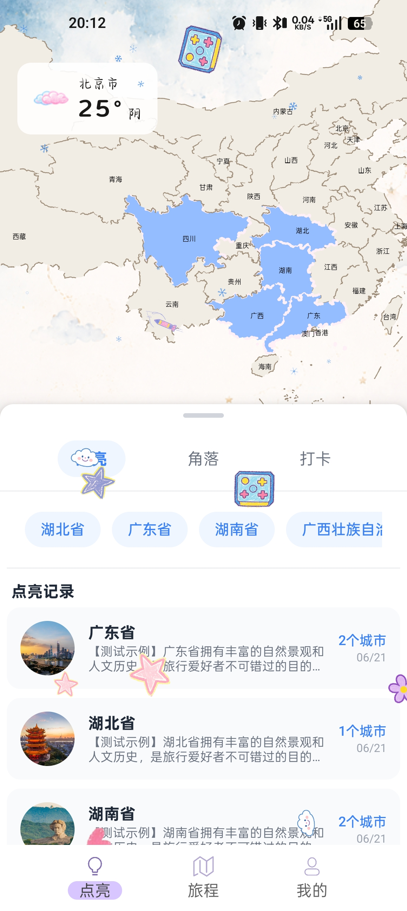
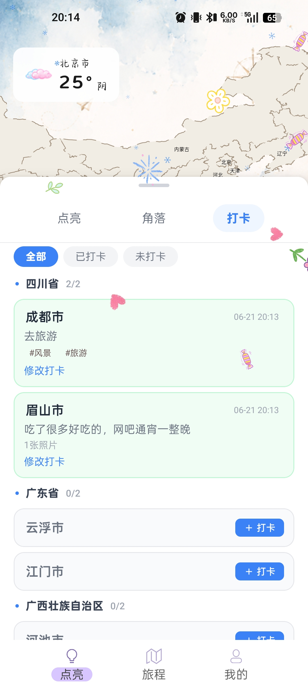
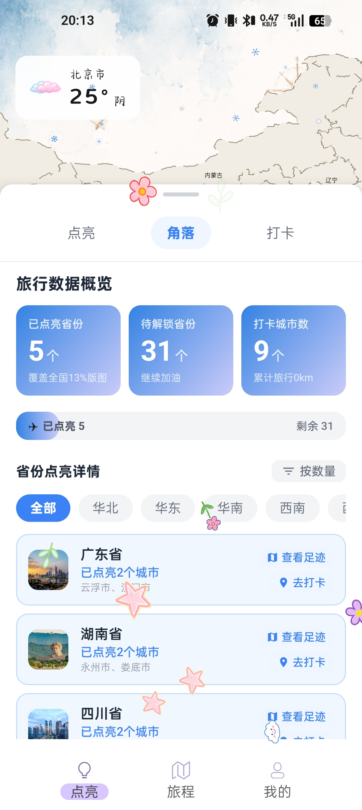
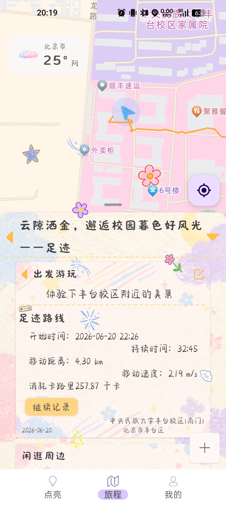
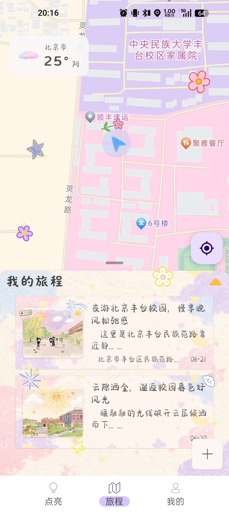
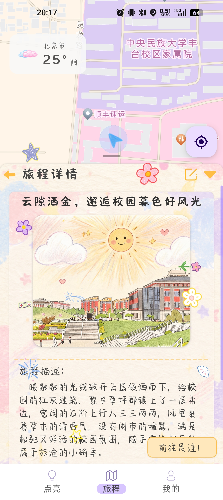
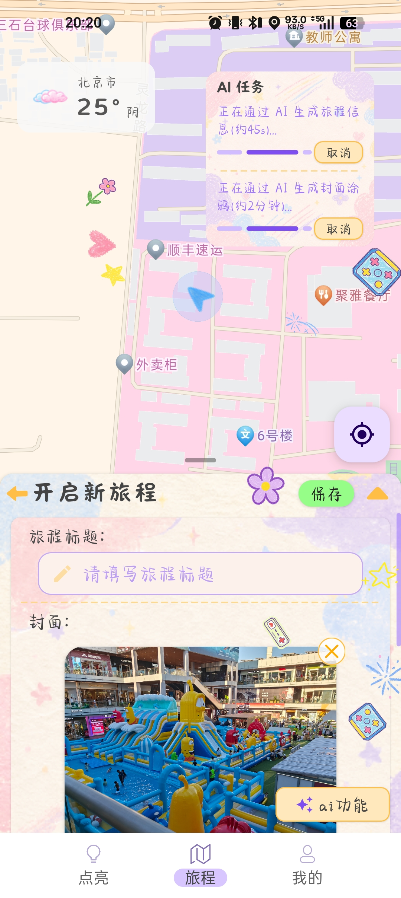

\# 旅行足迹手绘地图


记录旅行足迹、绘制路线、生成见闻的 Android App，接入高德地图与豆包大模型。


\## 项目成员


\- \*\*我\*\*：Android 端开发（Kotlin + Jetpack Compose）、高德地图 SDK 集成、自定义 GeoJSON 地图渲染、成就系统、UI 交互

\- \*\*队友\*\*：Python Flask 后端搭建、豆包 API 对接、AI 功能（图片风格迁移、智能填写见闻）


\&gt; 注：本项目为团队协作课程项目，Android 端代码由我独立负责，后端服务由队友提供。


\## 技术栈


\- \*\*Android\*\*：Kotlin + Jetpack Compose + Material Design 3

\- \*\*架构\*\*：MVVM + Repository 模式 + Hilt 依赖注入

\- \*\*本地数据\*\*：Room 数据库 + SQLite

\- \*\*地图\*\*：高德地图 SDK + 自定义 GeoJSON 数据 + SVG 手绘风格渲染

\- \*\*后端\*\*：Python Flask（队友负责，提供 AI 服务接口）

\- \*\*AI\*\*：豆包大模型 API（图片风格迁移、文本生成）


\## 功能亮点


\- \*\*手绘风格地图\*\*：基于 GeoJSON 自主绘制中国省份/城市边界，支持水彩、铅笔、复古、水墨、蜡笔 5 种风格切换

\- \*\*足迹记录\*\*：点击地图标记城市，记录到访时间、见闻、照片

\- \*\*旅程管理\*\*：创建多段旅程，绘制路线，自动统计里程

\- \*\*AI 辅助\*\*：调用后端豆包 API，根据照片生成旅行见闻，支持图片风格迁移

\- \*\*成就系统\*\*：自动统计探索城市数、总里程，解锁等级成就

\- \*\*数据导出\*\*：支持导出旅程数据为 JSON 备份


\## 项目截图

| 页面 | 页面 |
|:---:|:---:|
|  |  |
|  |  |
|  |  |
|  |  |


\## 本地运行


\### 环境要求

\- Android Studio Hedgehog 或更高版本

\- JDK 17

\- Android SDK 34+


\### 运行步骤


1\. 克隆项目

```bash

git clone https://github.com/你的用户名/TravelFootprint.git

